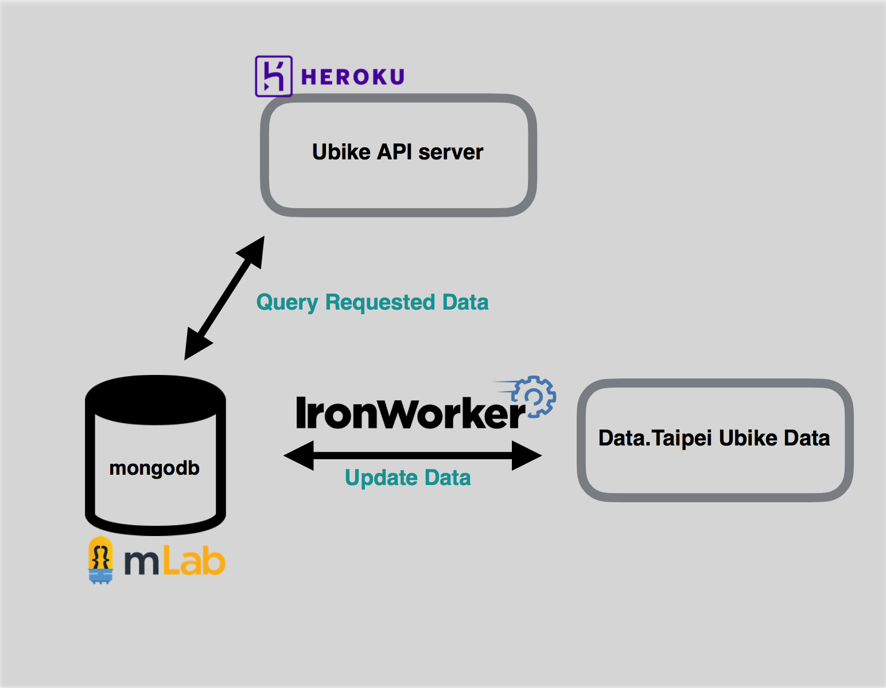

# ubike-api
[ ](https://app.codeship.com/projects/214211)

# Architecture



- worker will updates data every 10 minuts
#### Application Routes

- GET `/`: root route

#### Initialization and Update Routes
- POST  `/v1/ubike-station/init` : initialize the database and fetch the latest data
- GET  `/v1/ubike-station/update` : update the data and fetch the latest data

#### Query Routes

- GET `/v1/ubike-station/taipei?lat=[lantitude]&lng=[lontitude]`

`return_body = {
  "code": $status_code,
  "result": $result_list
  }`

` $status_code:`
- 1: all ubike stations are full
- 0: OK
- -1: invalid latitude or longitude
- -2: given location not in Taipei City
- -3: system error

## Install

Install this API required gems

```
$ bundle Install
```

## Testing

Test this API by running:

```
$ bundle exec rake api_spec
```

## Execute
Run this API during deployment:

```
$ bundle exec rackup
```
